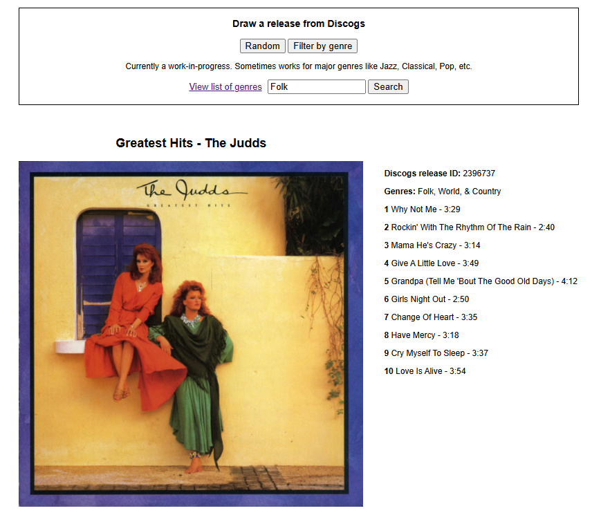
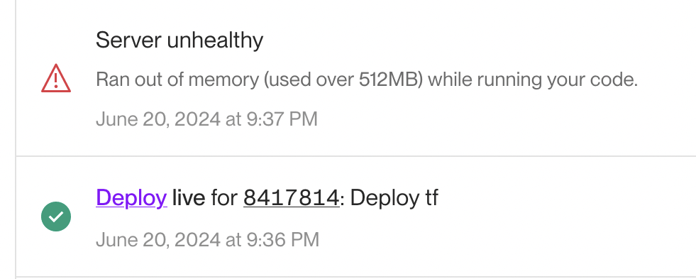

## Museko


A genre classification and Discogs release discovery tool for macOS and Linux.

Relies on [Essentia](https://github.com/MTG/essentia), which does not have Python bindings for Windows. You can still use this tool with WSL, and a Dockerfile is provided.

Some features of this tool:

- Genre classification referencing the Discogs style taxonomy ([genre_discogs400](https://essentia.upf.edu/models.html))
- Audio visualization with [audioMotion-analyzer](https://audiomotion.dev/#/)
- Download .mp3 audio files from supported sites with yt-dlp
- Discogs release roulette with limited genre filtering support




## Usage
This tool requires too much memory to be hosted online using free services.
The only way to try out this app would be to run it locally. A desktop app is currently in development.



## Instructions (macOS/Linux)

1. Download the latest `museko.zip` from the [Releases](https://github.com/bmai1/museko/releases) page and extract it.

2. Create and activate a virtual environment:

```bash
cd path/to/museko
python -m venv venv
source venv/bin/activate
```

3. Install dependencies:

```bash
pip install -r requirements.txt
```

4. Start the Flask development server:

```bash
flask --app apps/web/app.py run
```

The application will be available at http://127.0.0.1:5000.

5. Upload MP3 files to analyze. After a few seconds, the genre prediction graph and audio visualizer will appear.

6. Press `Ctrl+C` in the terminal to stop the server.

## Docker

Docker allows Museko to run on Windows, macOS, and Linux without installing Python or Essentia locally.

1. Download the latest `museko.zip` from the [Releases](https://github.com/bmai1/museko/releases) page and extract it.

2. From the project root, start the application:

```bash
docker compose up --build
```

The app will be available at http://localhost:5000.

3. When you're finished, stop and remove the container:

```bash
docker compose down
```

Alternatively, you can build and run without compose.
```bash
docker build -t museko .
```

```bash
docker run -it --rm -p 5000:5000 museko
```

Press `Ctrl+C` to stop the Flask server. The container will be removed after exiting with the --rm flag.